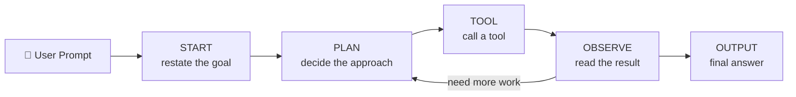

<h1 align="center">🧠 G-Code</h1>

<p align="center">
  <b>A local, open-source AI coding agent — think "Claude Code", but running entirely on your own machine.</b>
</p>

<p align="center">
  
  
  
  
  
</p>

---

## ✨ What is G-Code?

**G-Code** is a terminal-based AI agent that turns plain-English requests into real actions on your computer — creating folders, scaffolding files, running commands, and building small projects for you.

It's inspired by tools like **Claude Code**, but with two key differences:

- 🔒 **100% local & private** — powered by [Ollama](https://ollama.com) running an open model (`qwen2.5:7b`). No API keys, no cloud, no cost, works offline.
- 🧩 **Fully transparent reasoning** — the agent thinks out loud through explicit **START → PLAN → TOOL → OBSERVE → OUTPUT** steps, so you can watch exactly *how* it decides to act.

Under the hood it implements a classic **ReAct-style agent loop** with **structured JSON output** (validated by Pydantic) and a small set of **tools** the model can call.

---

## 🎬 Demo

```text
You: create a folder called Todo and put an index.html inside it that says Hello World

🚀 Starting...
💡 Create folder Todo and an index.html with Hello World inside it
🧠 Planning...
📋 First create the folder with runCommand, then write the file with writeFile
🔧 Calling Tool: runCommand
📝 Input: mkdir Todo
📊 Tool Output: Command executed successfully
🔧 Calling Tool: writeFile
📝 Input: Todo/index.html|||<!DOCTYPE html><html><body><h1>Hello World</h1></body></html>
📊 Tool Output: File 'Todo/index.html' created successfully
✅ Final Output!
💻 Created the Todo folder with an index.html that displays "Hello World".
```

---

## 🧠 How it works

G-Code drives the language model through a strict, step-by-step reasoning cycle. Each step is returned as a **structured JSON object** and validated with **Pydantic** before the agent acts on it.



| Step | Purpose |
|------|---------|
| **START** | Restates the user's goal in the agent's own words |
| **PLAN** | Reasons about *how* to solve it (chain-of-thought) |
| **TOOL** | Calls one of the available tools with an input |
| **OBSERVE** | Feeds the tool's result back into the model |
| **OUTPUT** | Produces the final answer once the task is done |

The loop repeats (up to a retry limit) until the model emits an `OUTPUT` step — and a guard-rail forces the agent to actually **call a tool** before it's allowed to declare success.

### 🛠️ Available tools

| Tool | Signature | What it does |
|------|-----------|--------------|
| `runCommand` | `runCommand(cmd: str)` | Runs a Windows shell command (e.g. `mkdir Todo`) with a timeout |
| `writeFile` | `writeFile("path\|\|\|content")` | Creates a file (and parent folders) with the given content |
| `get_weather` | `get_weather(city: str)` | Fetches live weather for a city via [wttr.in](https://wttr.in) |

> Adding your own tool is easy — write a Python function and register it in the `Available_Tools` dictionary.

---

## 📦 Prerequisites

Before you start, make sure you have:

1. **Python 3.10+** — [download here](https://www.python.org/downloads/)
2. **[Ollama](https://ollama.com/download)** installed and running locally
3. The **`qwen2.5:7b`** model pulled into Ollama (≈4.7 GB download)

> 💡 **Windows note:** G-Code's system prompt and `runCommand` tool are written for **Windows** commands (`mkdir`, etc.). It runs great on macOS/Linux too — just tweak the command examples in the system prompt inside `main.py`.

---

## 🚀 Getting started

### 1. Clone the repository

```bash
git clone https://github.com/<your-username>/G-Code.git
cd G-Code
```

### 2. Create & activate a virtual environment

```bash
# Windows (PowerShell)
python -m venv venv
venv\Scripts\activate

# macOS / Linux
python3 -m venv venv
source venv/bin/activate
```

### 3. Install the Python dependencies

```bash
pip install -r requirements.txt
```

### 4. Start Ollama and pull the model

Make sure the Ollama app/service is running, then:

```bash
ollama pull qwen2.5:7b
```

By default G-Code connects to Ollama at `http://localhost:11434`.

### 5. Run the agent

```bash
python main.py
```

You'll get a `You:` prompt — type what you want and watch the agent think and act. Press `Ctrl+C` to exit.

---

## ⚙️ Configuration

### Change the model

Any tool-capable Ollama model works. Edit the model name in `main.py`:

```python
response = client.chat(
    model="qwen2.5:7b",   # 👈 swap for llama3.1, mistral, etc.
    format=MyoutputFormat.model_json_schema(),
    messages=message_History,
)
```

### Use a cloud model instead (optional)

`main.py` includes a commented-out setup for using **Google Gemini** through its OpenAI-compatible endpoint. To use it, install `openai` (`pip install openai`), uncomment that block, add your API key, and switch the client calls accordingly.

---

## 🗂️ Project structure

```
G-Code/
├── main.py            # The agent: system prompt, tools, and the ReAct loop
├── requirements.txt   # Python dependencies
└── README.md          # You are here
```

Any folders/files the agent creates for you (e.g. a generated `Todo/` app) appear in this directory when you run it.

---

## 💡 Example prompts to try

- `create a folder named Portfolio and add an index.html with a heading`
- `build a simple Todo app with html, css and js inside a Todo folder`
- `what's the weather in London?`
- `make a Python script hello.py that prints Hello from G-Code`

---

## 🧭 Roadmap & ideas

- [ ] Cross-platform command support (auto-detect OS)
- [ ] A `readFile` / `editFile` tool for modifying existing code
- [ ] Streaming output for faster feedback
- [ ] Conversation memory / context window management
- [ ] A simple web or TUI front-end

## ⚠️ Limitations

- The `runCommand` tool executes shell commands on your machine — **only run prompts you trust.**
- Reasoning quality depends on the local model; smaller models occasionally need a retry.
- Currently tuned for Windows commands out of the box.

---

## 🛠️ Built with

**Python** · **Ollama** · **qwen2.5:7b** · **Pydantic** · **Requests** · a ReAct-style agent architecture

---

## 📄 License

Released under the **MIT License** — free to use, modify, and share.

---

<p align="center">Built with ❤️ by <b>Gagan Singh</b></p>
